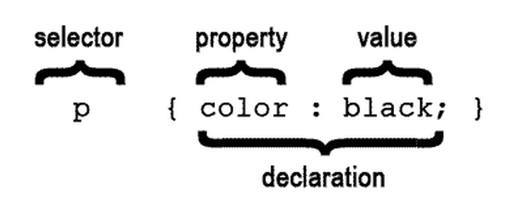
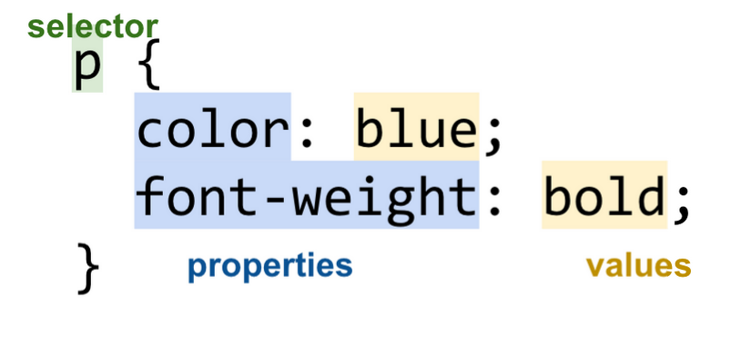

#CSS Basics

#Objectives:
+	Explain the purpose of CSS
+	Use selectors
+	Write CSS Syntax
+	Link a CSS stylesheet to an HTML page
+	Adjust basic properties of text: font-size, font-family, text-align, font-color
+	Adjust basic properties of images: height, width
+	Adjust backgrounds elements
+	Use hexadecimal, rgba, and rgb color values
+ Import Google fonts

#Motivation / Why Should You Care?

Check out <a href="https://twitter.com/beyonce">Beyonce’s twitter page</a> Her page is styled with CSS. Without CSS her twitter page would look really boring! So far, all we’ve been able to do is put content on a page with HTML to make some ugly looking websites. So how do we actually make our sites stuff look good?
CSS! CSS stands for Cascading Style Sheets. We write CSS in separate files, so that each file of our web site does one job and one job only.

#Code-Along-Setup
+ On your desktop create a new folder by going to the top right of your computer and clicking "File New Folder"
+ Rename the folder my_profile_project
+ Drag your my_profile.html file from the desktop into your my_profile_project folder
+ Click into your my_profile_project and your finder window should pop up
+ Create a new file called style.css

#Linking our Stylesheet
We write our CSS in a separate file - style is a different job than structure. This is called an external style sheet. You can change the styling on entire website in one css file!
Each html page must include a reference to the external style sheet file. Copy and paste this into your my_profile.html page. It should be between the `<head>,</head>` tags
```
<head>
<link rel="stylesheet" type="text/css" href="style.css">
</head>
```

#Selectors
Open your my_profile_project in Atom and click to edit your style.css file
In style.css, let's make our `<h1>` tags a different color.
To make `<h1>` the color red we use a type selector:
```
h1 {
 color: red;
}
```
There are three types of selectors:
**Type selector**: selects all of the elements by html tag
**Class selector**: makes a class or a category that is associated with as many html elements
**ID selector**: can only be used one time to grab a single element.

Property and value go between curly braces - in this case the property is color and the value is red

Colons and semicolons are important - they end our statements.

The **property-value pairs** in between the curly braces {} are the styles (color: blue sets the text color to blue), and the **selector** defines (or “selects”) which elements these styles apply to.

Types of Selectors
There are 3 basic types of selectors:


Name
Example
Definition
Selector
p
 all <p> elements on the page
Id Selector
#abc
   element with abc id
Class Selector
.abc
   elements with abc class

The first of these is a basic selector, and it’s composed of the name of the tag for which these styles apply. Using a basic selector the style rule applies to all elements of this type on the page.

An id selector selects a particular element that has the id attribute defined to a given value. For example, #main selects the HTML element that has an attribute id=main. Each id should be unique in an HTML page; no two HTML elements should have the same id.

A class selector selects all elements that have the class attribute defined to a given value. For example, .navigation selects all HTML elements that have an attribute class=navigation. Classes are not unique and there can be many elements with the same class name.

We’ll go the different types of selectors in more detail via an exercise.

Exercise: Favorite Songs

Imagine you’re building a page with all your favorite playlists:


<!DOCTYPE html>
<head>
 <title>My Playlists</title>
</head>
<body>
 <h1>Victoria's Playlists</h1>
 <h2>Workout Playlist</h2>
 <ul>
 <li>Break Free by Ariana Grande</li>
 <li>Do It Again by Robyn</li>
 <li>Shake It Off by Taylor Swift</li>
 <li>B.O.B. by OutKast</li>
 </ul>
 <h2>Bedtime Playlist</h2>
 <ul>
 <li>Such Great Heights by Iron &amp; Wine</li>
 <li>Passenger Seat by Death Cab for Cutie</li>
 <li>Wedding Song by Yeah Yeah Yeahs</li>
 </ul>
</body>
Adding a CSS file
We’ll define the CSS styles in a separate file. First make a new directory called css. Then cCreate and save a new file called style.css with the following contents:

h2 {
 color: green;
}

Then add a link element to your HTML in the <head> section.
<head>
 <title>My Playlists</title>
 <link rel="stylesheet" href="css/style.css">
</head>
This should produce the following output:
Notice how both <h2> elements have a font color of green. That’s because the h2 selector selects all h2 elements on the page.
Change the Font
Let’s starting trying to make this page prettier. First of all, let’s change the font to something prettier, like Arial. This is specified by the font-family property.

We really want to change the font for all the text on the web page. How can we do that?

We could add rules for every element:

h1 {
 font-family: Arial;
}

h2 {
 color: green;
 font-family: Arial;
}

li {
 font-family: Arial;
}

This works, but it’s kind of annoying to have the write the same rule all the time. Plus, what if we wanted to change the font again? We’d have to update it in every place.

We have a couple of options on how to define the style more concisely.
Combining selectors with comma
You can combine selectors using a comma:

h1, h2, li {
 font-family: Arial;
}

h2 {
 color: green;
}

Notice the selector “h1, h2, li”: the comma is like an “and.” This rule says, apply “font-family: Arial;” to all h1s and all h2s and all lis. Note that you can still create other rules that reference the same element, and we see color: green is defined for h2.

It’s often very helpful to combine CSS selectors using comma, but actually in this scenario, it’s still a little annoying - what if we add a <p> element to the HTML:

 <h1>Victoria's Playlists</h1>
 <p>Check out my playlists!</p>

We’d have to remember to add “p” to the list of selectors:

h1, h2, li, p {
 font-family: Arial;
}

This gets pretty annoying to remember to do as a page grows more complex with more elements.
Inheriting styles
Really we want to say, “All elements on this web page should have font-family: Arial.”

If we apply a style to the parent element, all of its descendants will inherit that style, if that style is inheritable. In general, text-related styles are inheritable, and layout-related styles are not.
(TODO(vrk): explain child, parent, descendent and root)

We can then use this to our advantage to apply a style to parent element that contains all the elements we’d like to style in a certain way. In this case, the parent element containing every element on the page is the body element.

Change your CSS file to look like the following:

body {
 font-family: Arial;
}

h2 {
 color: green;
}

And you see that you get the desired result:


Colors
RGB vs Hexadecimal color
There are a few ways to get more specific with color value other than just writing "red". There are many tones of red
RGB- stands for Red, Green, Blue. RGB color model is the ways of getting different colors through adding different amounts of Red, Green, and Blue.
Count up from 0 amounts of each to 255 of each
rgb(0,0,0) gives you black
rgb(255,255,255) gives you white
Hexademical is a different notation for the amount of Red, Green, and Blue that gets added to your color.
count: 0, 1, 2, 3, 4, 5, 6, 7, ,8, 9, a, b, c, d, e, f
6 values: two red, two green, two blue
#000000 is black
#ffffff is white
#0000FF is blue (zero amounts of red and green)
Color Picker is a great resource to find other color tones
Fonts
Google fonts
Browsers can only display whatever fonts are downloaded on that computer.
If a web application is using some random font that my computer doesn't have, I won't be able to see it
Google fonts is a great resource
Click the quick view button
Scroll down the page till you see this and make sure import is selected:
Copy that the @import... text and paste it at the top of your CSS file
Step 4 shows you how to use the font:
They chose to style the font-weight property as well, you can ignore that
h1 {
   font-family: 'Metrophobic', Arial, serif;
 }
If you haven't already added three pages to your site: create three separate html files
Inside of those files set up your html file structure
Put links to your other pages in an unordered list using ul and li tags
We will style these links as a nav bar in our next class.
Conclusion / So What?
CSS allows us to add styling to our page. Together, HTML and CSS give us the web as we know it.

Hints and Hurdles
Test all your CSS examples first and know how you're going to live code them. It's easy to make mistakes here that are hard to get out of on the spot.
Stretch, have students use <div> tags and play around with box model: http://guyroutledge.github.io/box-model/
