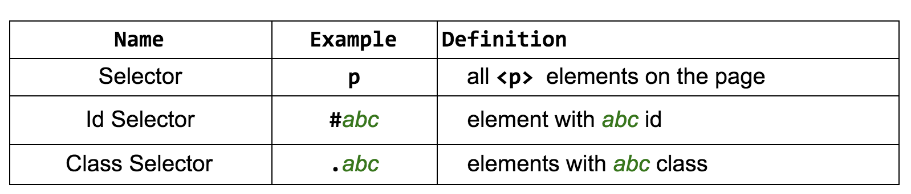
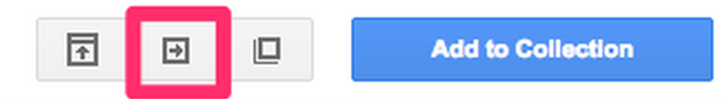
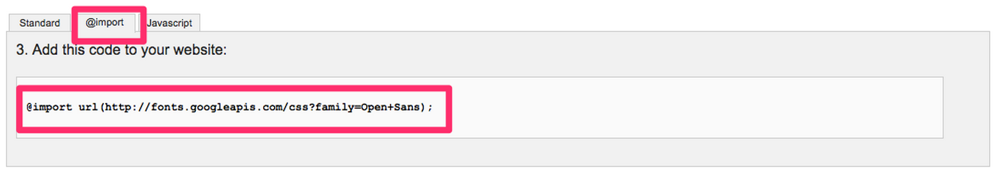
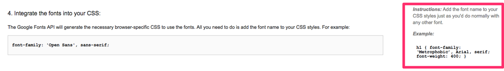

#CSS Basics

#Prior Knowledge:
+ Intro to the web
+ Github account setup
+ Learn.co walkthrough
+ Intro to HTML

#Student Objectives:
+	Explain the purpose of CSS
+	Use selectors
+	Write CSS Syntax
+	Link a CSS stylesheet to an HTML page
+	Adjust basic properties of text: font-size, font-family, text-align, font-color
+	Adjust basic properties of images: height, width
+	Adjust backgrounds elements
+	Use hexadecimal, rgba, and rgb color values
+ Import Google fonts

#Motivation

So far, all we’ve been able to do is put content on a page with HTML to make some ugly looking websites. So how do we actually make our sites stuff look good?
CSS! CSS stands for Cascading Style Sheets. We write CSS in separate files, so that each file of our web site does one job and one job only.

#Linking our Stylesheet
We write our CSS in a separate file. Each html page must include a reference to the external style sheet file. The link below should be between the `<head>,</head>` tags
```
<head>
<link rel="stylesheet" type="text/css" href="style.css">
</head>
```

#Selectors
Open your my_profile_project in Atom and click to edit your style.css file
In style.css, let's make our `<h1>` tags a different color.
To make `<h1>` the color red we use a type selector:
```
h1 {
 color: red;
}
```

Property and value go between curly braces - in this case the property is color and the value is red

Colons and semicolons are important - they end our statements.

The **property-value pairs** in between the curly braces {} are the styles (color: blue sets the text color to blue), and the **selector** defines (or “selects”) which elements these styles apply to.


# Types of Selectors
There are three types of selectors:
+ **Type selector**: selects all of the elements by html tag
+ **Class selector**: makes a class or a category that is associated with as many html elements
+ **ID selector**: can only be used one time to grab a single element.


The first of these is a basic selector or type selector, and it’s composed of the name of the tag for which these styles apply. Using a basic selector the style rule applies to all elements of this type on the page.

An id selector selects a particular element that has the id attribute defined to a given value. For example, #main selects the HTML element that has an attribute id=main. Each id should be unique in an HTML page; no two HTML elements should have the same id.

A class selector selects all elements that have the class attribute defined to a given value. For example, .navigation selects all HTML elements that have an attribute class=navigation. Classes are not unique and there can be many elements with the same class name.

#Boiler Plate Code
```
<!DOCTYPE html>
<html>
  <head>
   <link rel="stylesheet" href="my_profile_project/favorite_songs_style.css">
    <title>My Playlists</title>
  </head>
  <body>
   <h1>Victoria's Playlists</h1>
   <h2>Workout Playlist</h2>
   <ul>
     <li>Break Free by Ariana Grande</li>
     <li>Do It Again by Robyn</li>
     <li>Shake It Off by Taylor Swift</li>
     <li>B.O.B. by OutKast</li>
   </ul>
   <h2>Bedtime Playlist</h2>
   <ul>
     <li>Such Great Heights by Iron &amp; Wine</li>
     <li>Passenger Seat by Death Cab for Cutie</li>
     <li>Wedding Song by Yeah Yeah Yeahs</li>
   </ul>
  </body>
</html>
```

Adding a CSS file We’ll define the CSS styles in a separate file. In your my_profile_project folder create a new file called favorite_songs_style.css Open favorite_songs_style.css in Atom Copy this boilerplate code
```
h2 {
 color: green;
}
```

# Colors
RGB vs Hexadecimal color
There are a few ways to get more specific with color value other than just writing "red". There are many tones of red
RGB- stands for Red, Green, Blue. RGB color model is the ways of getting different colors through adding different amounts of Red, Green, and Blue.
Count up from 0 amounts of each to 255 of each
rgb(0,0,0) gives you black
rgb(255,255,255) gives you white
Hexademical is a different notation for the amount of Red, Green, and Blue that gets added to your color.
count: 0, 1, 2, 3, 4, 5, 6, 7, ,8, 9, a, b, c, d, e, f
6 values: two red, two green, two blue
`#000000` is black
`#ffffff` is white
`#0000FF` is blue (zero amounts of red and green)
Color Picker is a great resource to find other color tones

#Fonts
Google fonts
Browsers can only display whatever fonts are downloaded on that computer.
If a web application is using some random font that my computer doesn't have, I won't be able to see it
Google fonts is a great resource
Click the quick view button

Scroll down the page till you see this and make sure import is selected:
Copy that the @import url and paste it at the top of your CSS file

Step 4 shows you how to use the font:

They chose to style the font-weight property as well, you can ignore that
```
h1 {
   font-family: 'Metrophobic', Arial, serif;
 }
 ```
Conclusion / So What?
CSS allows us to add styling to our page. Together, HTML and CSS give us the web as we know it.

#Conclusion
Now you know how to add styling to your HTML pages. Use different types of selectors to change elements within your HTML page.

#Labs
Add CSS styling to your my_profile.html pages. Don't forget to reference your css stylesheet in the head of your HTML page using " reference to the external style sheet file. Copy and paste this into your my_profile.html page. It should be between the `<head>,</head>` tags
```
<link rel="stylesheet" type="text/css" href="style.css">
```
If you are finished try a stretch lab about the CSS box model: http://guyroutledge.github.io/box-model/
